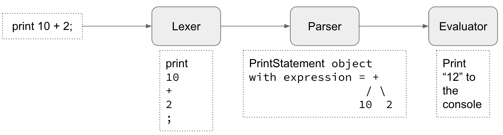

# Writing an Interpreter: High-Level Overview

## Introduction

Creating a new language for specific logics is sometimes unavoidable. Some use cases can be listed out:
- We want to develop a highly dynamic application that enables non-technical business users and system admins to customize the system and its workflow by writing code. I aim to make the application highly configurable without the need for a complex user interface. This approach is commonly referred to as a domain-specific language (DSL).
- Code Generation and Automation: Building a custom language can facilitate code generation and automation for repetitive or complex tasks. By defining a language that closely matches the problem domain, developers can write code at a higher level of abstraction and generate boilerplate or repetitive code automatically.

This article aims to offer simple instructions on constructing an interpreter for a custom programming language.

## Interpreter and compiler

An interpreter is a software component or program that directly reads and executes code without prior compilation. It is often used with scripting languages and high-level programming languages. Notable interpreted languages include Python, JavaScript, and PHP.

In contrast, compilers take code as input and generate assembly or bytecode that requires a virtual machine for execution. Examples of compiled languages are C/C++, Java, C#, Go, and Rust.

Compiled languages tend to offer higher performance compared to interpreted ones because compilers perform extensive optimization during the compilation process.

## Main components

### Lexer, parser and evaluator

There are 3 main components in an interpreter:
- Lexer (or Tokenizer): responsible for breaking down the source code into individual tokens. It scans the code character by character and groups them into meaningful units such as keywords, identifiers, operators, literals, and symbols.
- Parser: takes the tokens produced by the lexer and analyzes their structure based on a defined grammar or syntax rules. It ensures that the code follows the correct syntax and creates a data structure called an Abstract Syntax Tree (AST) or parse tree, which represents the hierarchical structure of the code.
- Evaluator:  is responsible for executing the code and producing the desired results. It takes the parsed and analyzed code, such as an Abstract Syntax Tree (AST) or an intermediate representation, and performs the necessary computations and operations specified by the code

While advanced interpreters may include additional components like the Semantic Analyzer and IR Generator, for the purpose of understanding how to write an interpreter, we won't discuss those specifics here.

### Example

Given the code
```
print 10 + 2;
```

The following logics will happens in components:


- Lexer breaks down the code and represent it as a list of token objects with type. In this example, there are 4 types: print, int number (10 and 2), plus and semicolon.
- Parser iterates through the list of tokens to form statement object. In this case, it's a PrintStatement with expression is a infix AST.
- Evaluator iterates through the list of statments getting from Parser, evalute them and give the final result. In this case, it's printing 12 to the console

Part 2: [Implementation](./write-an-interpreter-implementation.md)